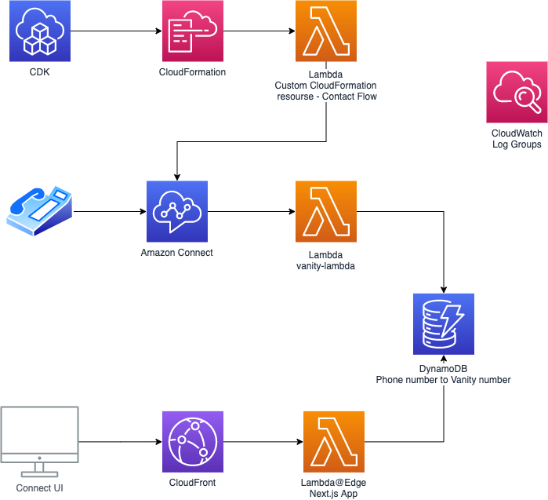
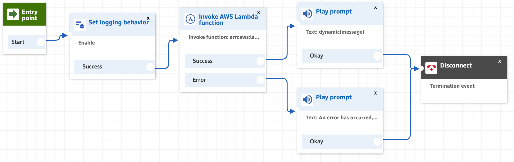

# Foundry Connect
An implementation of a Amazon Connect Contact Flow for generating vanity numbers and a UI to see the latest customer calls and numbers

## Prerequisites 
* NPM is required to install dependencies
* You need to be authenticated against AWS using the access key and id for the desired account in region eu-west-2
* If not already performed, you need to bootstrap CDK in the regions eu-west-2 and us-east-1 `npx cdk bootstrap`
* You will need exactly 1 Amazon Connect instance in eu-west-2

## Installation
* Run `npm install` at the top level and also in the `lib/connect-ui` directory

## Deployment
1. To deploy the full application simply run `npm run deploy` and wait for CDK to deploy the CloudFormation stacks
   * You can also deploy the stacks individually if you prefer: 
     * `npm run cdk deploy FoundryConnectStack`
     * `npm run cdk deploy FoundryConnectUiStack`
2. After the stacks are deployed you will need to add the Lambda to the Connect instance to grant the IAM permission:
   * [Amazon Connect](https://eu-west-2.console.aws.amazon.com/connect/v2/app/instances) > Select Instance > Contact flows > AWS Lambda > Select `vanity-lambda` > Click Add Lambda Function

3. In the Amazon Connect portal for the instance, navigate to `Phone numbers` and select `vanity-contact-flow` as the contact flow for the desired phone number
4. To view the UI you can see what the CloudFront distribution URL is [here](https://console.aws.amazon.com/cloudfront/v3/home)

You can now call the Connect phone number and see the results in the UI

## Architecture
The application uses CDK to deploy all services so the Frontend, Backend and Infrastructure can all be written in TypeScript, reducing the overhead of learning different languages. Also CDK offers all of the benefits of real code for the infra.

The UI is deployed as a serverside rendered Next.js app to CloudFront using Lambda@Edge. This not only makes it very performant but it is also very easy to write and provision in CDK without the need for APIs called from the browser.

Note that the deployment for the UI is in the us-east-1 region as that is the requirement for Lmabda@Edge (The Lambda you use however, will be in the region closest to you)

See `lib/vanity-numbers/vanity-generator.ts` for details of the Vanity Number algorithm

### Architecture diagram

### Contact flow

## Limitations
* The custom CloudFormation Resource Lambda assumes exactly 1 instance of Amazon Connect already exists, it also cannot handle removal of the contact flow however this is a limitation in AWS itself.
* The UI needs the Region hardcoding because Lambda@Edge doesn't support environment variables - this could be solved by using parameter store to store the Amazon Connect region 
* The Connect Instance needs IAM permissions to execute the Lambda function, adding manually in the Console - investigation could be performed to see if the custom resource Lambda could grant this permission automatically
* Currently the data in DynamoDB will be overwritten for repeat callers and the previous data will be lost. However this seems acceptable for this use case

## Productionisation
* To facilitate further development by a team, a CI/CD solution needs setting up e.g CircleCI or GitHub Actions. This could automate deployments to environments when branches are pushed to
* The UI currently does a Scan on DynamoDB to get all the data and filter the most recent 5 contacts. This won't scale to large numbers of callers
* Alarms and metrics need setting up for all components of the stacks to improve observability
* The UI requires no authentication so currently is available to anyone on the public internet. There is also no protection such as a WAF on the CloudFront distribution to protect against attacks
* Consideration should be given to blocking excessive traffic to the Connect instance & UI to ensure unexpected AWS costs are not incurred
* Integration & E2E tests could be written to test the stack after it is deployed. Most of the untested logic is tightly coupled with AWS SDK calls which limits the amount of useful unit testing you can do

## Difficulties
* Custom Resource Functions are hard to debug due to CloudFormation having a long timeout (up to 2 hours), I ended up deploying several different versions while they were clearing up.
  * I discovered that if you use the higher level construct in CDK for Custom Resource Providers then the error handling is done for you so building and testing becomes a lot easier
* Recreating the flow in Connect Flow Language was difficult as it seems the Export/Import functionality in the UI is in a different format
  * I ended up using find and replace to convert the exported Contact Flow to the Connect Flow Language. If I had to do this again I would find, or write a converter between the formats and/or ask AWS why they are different

